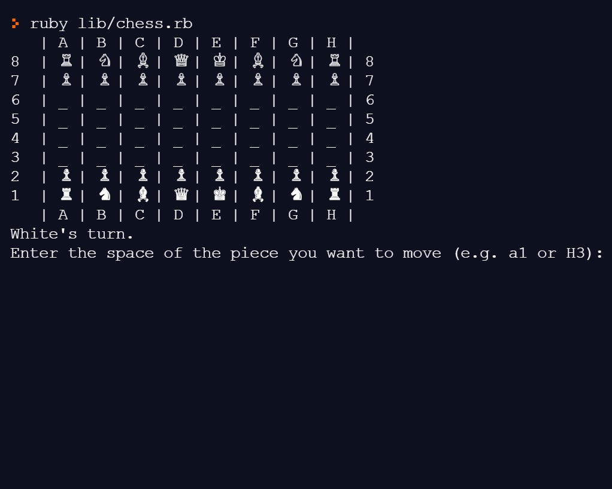

# Chess

A two-player command-line version of chess written with Ruby and tested using RSpec.

The current version enforces international chess rules (see: Rules section below). However, there are a number of items in the pipeline to enhance UX and gameplay options. 

<br>
*Demo of the [Fool's Mate](https://en.wikipedia.org/wiki/Fool%27s_mate) - the fastest checkmate in chess!*

## Play Now

Play the game online [here](https://replit.com/@SG12/rubychess?v=1)!

See the 'How to Play' section below if you would prefer to download the game.

## Rules

The game enforces regular international chess rules. See [Wikipedia](https://en.wikipedia.org/wiki/Chess) for a refresher and be sure not to forget:
* en passant capture
* pawn promotion
* castling


## How to Play

The game will look different depending on the command line interface used to play and the current version has been optimized for use with repl.it which you use to play online [here](https://replit.com/@SG12/rubychess?v=1).

If you are using Windows Subsystem for Linux, you will need to comment/uncomment a number of lines (all marked with a comment including 'line to use with WSL') due to unsupported use of some unicode characters. This WSL correction affects lib/board.rb, lib/game.rb, and spec/chess_spec.rb.

### Prerequisites
* ruby >= 2.6.5
* bundler >= 2.1.4

### Installation

1. Clone this repo. [Instructions](https://docs.github.com/en/free-pro-team@latest/github/creating-cloning-and-archiving-repositories/cloning-a-repository)
1. Navigate into this project's directory ``` cd chess ```
1. Run ``` bundle install ```

### To Play
Run ```ruby lib/chess.rb ```

## Running the RSpec Tests
* To run the entire test suite, run ```rspec```
* To run the test suit with detailed output, run ```rspec --format documentation```
